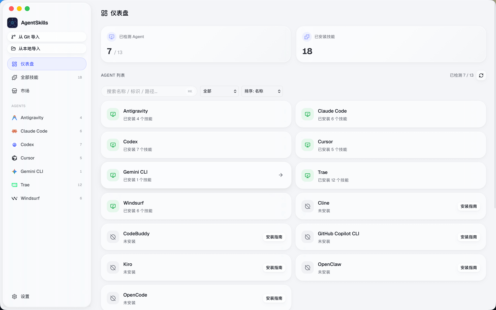
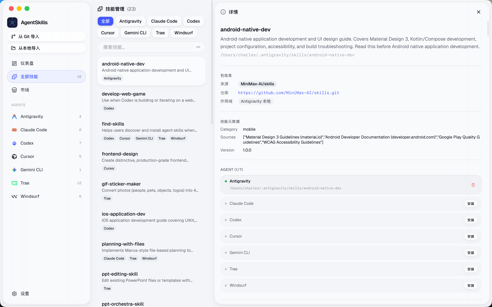
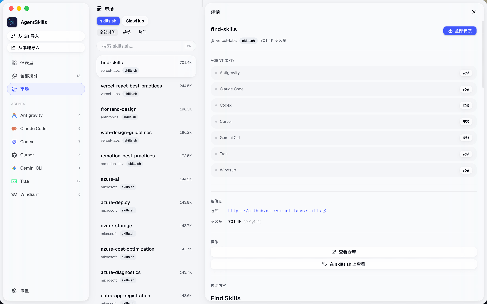
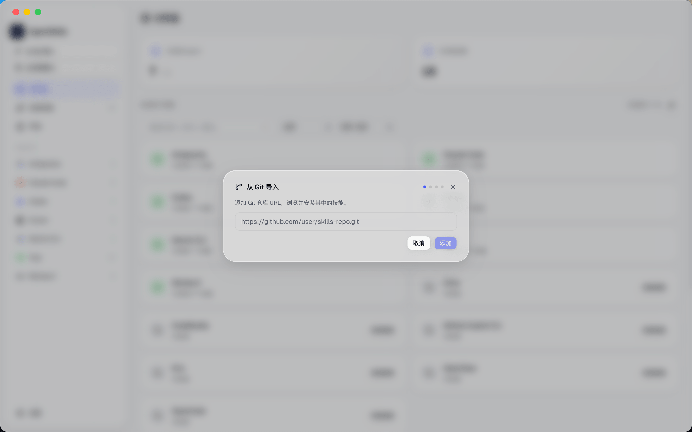
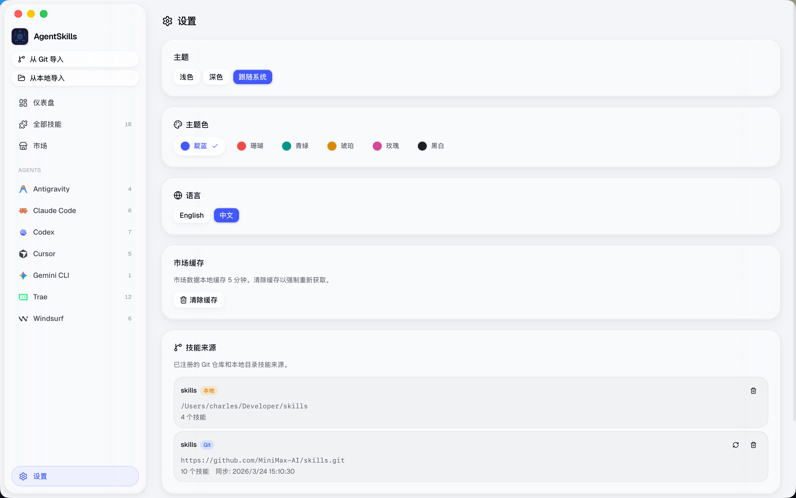

<p align="center">
  
</p>

<h1 align="center">技能管家 · SkillsMaster</h1>

<p align="center">
  跨平台桌面应用，统一管理 36 款 AI Agent 的技能。<br>
  浏览、安装、同步、编辑，一站式搞定。
</p>

<p align="center">
  <a href="https://github.com/louiseliu/skills-master/releases"></a>
  <a href="https://github.com/louiseliu/skills-master/blob/main/LICENSE"></a>
  <a href="https://github.com/louiseliu/skills-master/stargazers"></a>
</p>

---

## 关于作者

**五柳大叔** — 干的是未来事的大叔 🧓➡️🤖

> 白天聊 Prompt，晚上研究 Agent
> 把复杂的 AI，翻译成人话

---

## 支持的 AI Agent

### 编程 & 开发

| Agent | 类型 | 说明 |
|-------|------|------|
| Claude Code | CLI | Anthropic 官方编程 Agent |
| Cursor | IDE | AI-first 代码编辑器 |
| Codex | CLI | OpenAI 编程 Agent |
| Gemini CLI | CLI | Google AI 命令行工具 |
| GitHub Copilot CLI | CLI | GitHub 代码助手 |
| Cline | IDE 插件 | VS Code AI 助手 |
| Trae | IDE | 字节跳动 AI 编辑器 |
| Windsurf | IDE | Codeium AI 编辑器 |
| OpenCode | CLI | 开源编程 Agent |
| Kiro | IDE | AWS 出品 AI 编辑器 |
| Factory | CLI | AI 编程工具 |
| Warp | 终端 | AI 原生终端 |
| Qoder | IDE 插件 | AI 编程助手 |
| CodeBuddy | IDE | 腾讯 AI 代码助手 |
| Antigravity | CLI | AI Agent 框架 |

### 龙虾家族（OpenClaw 生态）

| Agent | 出品方 | 说明 |
|-------|--------|------|
| OpenClaw | 社区 | 开源个人 AI 助手框架，36 万 GitHub Stars |
| AutoClaw | 智谱 AI | 一键部署 OpenClaw 桌面客户端 |
| QClaw | 腾讯 | 腾讯出品，微信直连龙虾助手 |
| LobsterAI | 网易有道 | 有道龙虾，桌面全场景 AI 助理 |
| DuMate | 百度 | 办公搭子，桌面级 AI 智能体 |
| 360Claw | 360 | 360 安全龙虾，自带安全铠甲 |
| WorkBuddy | 腾讯 | AI 原生桌面智能体工作台 |
| Manus | Manus AI | 通用 AI Agent 平台 |
| LobeHub | LobeHub | 开源 AI 对话框架 |
| Wukong | 社区 | 悟空龙虾 |
| StepBuddy | 阶跃星辰 | 阶跃 AI 助手 |
| QoderWork | 腾讯 | AI 办公工作台 |
| CoPaw | 社区 | AI 协作助手 |
| Nexu | 社区 | AI Agent 运行时 |
| NiuMaAI | 社区 | 牛码 AI |
| MuleRun | 社区 | 自动化任务执行 |
| PoorClaw | 社区 | 轻量龙虾方案 |
| LinkFoxClaw | 社区 | 企业级龙虾 |
| Loomy | 社区 | AI 创意助手 |
| Tabbit | 社区 | AI 标签管理 |
| JvsClaw | 社区 | Java 生态龙虾 |

## 功能特性

- **仪表盘** — 一览所有 Agent 的安装状态与技能数量，龙虾家族自动分组折叠
- **技能管理** — 查看、编辑、卸载技能，支持跨 Agent 一键同步
- **技能市场** — 三大来源：[skills.sh](https://skills.sh)、[ClawHub](https://clawhub.ai)、[SkillHub](https://skillhub.cn)
- **技能编辑器** — 应用内直接编辑 SKILL.md
- **文件监听** — 磁盘技能变动时自动刷新
- **跨 Agent 同步** — 一键将技能同步到所有已安装 Agent
- **批量更新** — 从 Git 上游一键更新所有技能

## 界面预览

<p align="center">
  
  
</p>
<p align="center">
  
  
</p>
<p align="center">
  
</p>

## 技术栈

| 层级 | 技术 |
|------|------|
| 前端 | React 19、TypeScript、Tailwind CSS 4、shadcn/ui |
| 原生核心 | Rust、Tauri 2、SQLite |
| 构建 | Vite 7、Cargo |

## 安装

### 方案 A：一行命令安装（推荐）

自动识别操作系统和架构，从 GitHub Releases 下载对应安装包。

**Linux / macOS：**

```bash
curl -fsSL https://raw.githubusercontent.com/louiseliu/skills-master/v0.1.8/install.sh | bash
```

**Windows（PowerShell）：**

```powershell
irm https://raw.githubusercontent.com/louiseliu/skills-master/v0.1.8/install.ps1 | iex
```

支持格式：Linux（`.deb` / `.rpm` / `.AppImage`）| macOS（`.dmg`）| Windows（`.exe` / `.msi`）

### 方案 B：macOS 使用 Homebrew

```bash
brew tap louiseliu/skills-master https://github.com/louiseliu/skills-master
brew install --cask skillsmaster
```

> 遇到 quarantine 问题？加上 `--no-quarantine` 参数。

### 方案 C：手动下载

前往 [GitHub Releases](https://github.com/louiseliu/skills-master/releases) 下载对应平台安装包。

### 常见问题

**macOS 提示"应用已损坏，无法打开"？**

```bash
sudo xattr -rd com.apple.quarantine "/Applications/SkillsMaster.app"
```

## 本地开发

### 环境要求

- [Node.js](https://nodejs.org/) v18+
- [Rust](https://rustup.rs/) stable
- [Tauri 平台依赖](https://v2.tauri.app/start/prerequisites/)

### 开发命令

```bash
npm install            # 安装依赖
npm run tauri dev      # 启动开发环境（Vite + Tauri）
npm run dev            # 仅前端（端口 1420）
npx tsc                # 类型检查
cd src-tauri && cargo test  # Rust 测试
```

### 构建

```bash
npm run tauri build
```

## 贡献

欢迎贡献！请先开 Issue 讨论你想做的改动。

## 社区

- [LINUX DO](https://linux.do/)

## 许可证

[MIT](./LICENSE)
