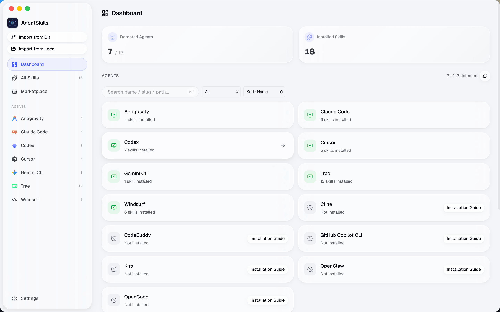
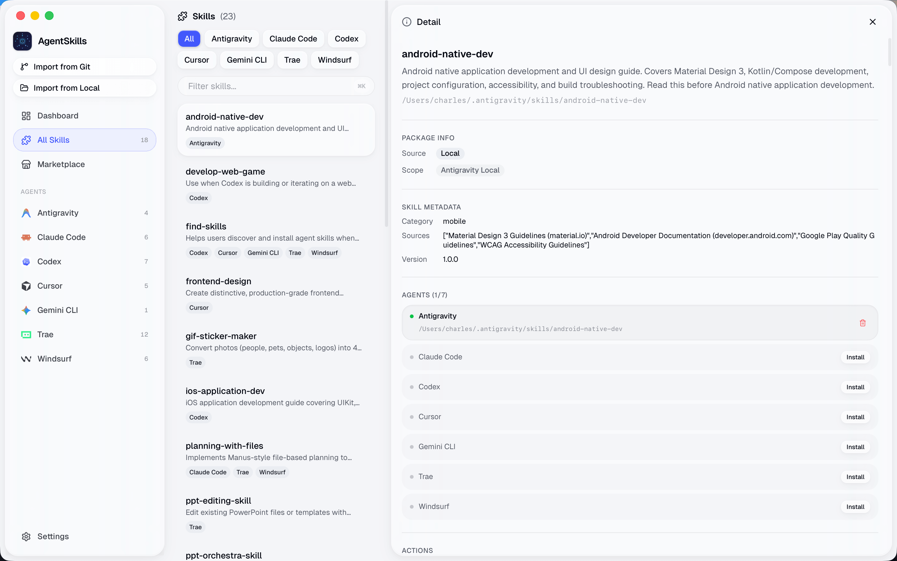
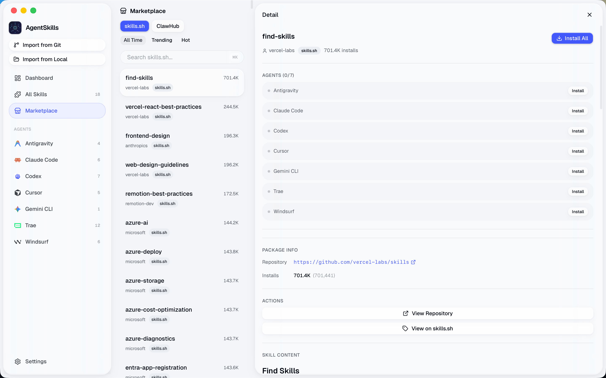
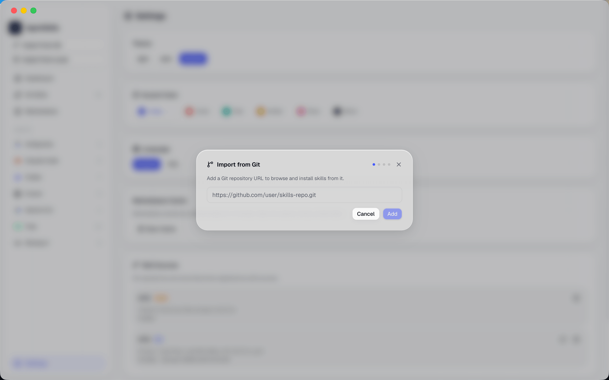
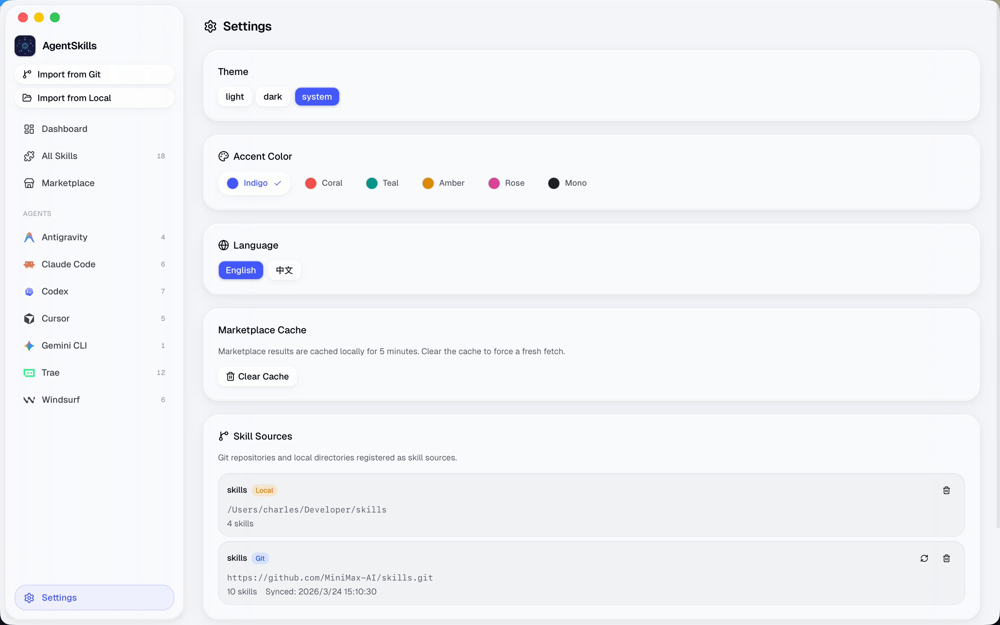

<p align="center">
  
</p>

<h1 align="center">AgentSkills</h1>

<p align="center">
  A cross-platform desktop app for managing AI agent skills.<br>
  Browse, install, sync, and edit skills across 13 agents from a single interface.
</p>

<p align="center">
  <a href="https://github.com/chrlsio/agent-skills/releases"></a>
  <a href="https://github.com/chrlsio/agent-skills/blob/main/LICENSE"></a>
  <a href="https://github.com/chrlsio/agent-skills/stargazers"></a>
</p>

<p align="center">
  <a href="./README.zh-CN.md">简体中文</a> | 
    <strong>English</strong>
</p>

---

## Supported AI Tools

- Claude Code
- Cursor
- Codex
- Gemini CLI
- GitHub Copilot CLI
- Kiro
- OpenCode
- Antigravity
- CodeBuddy
- OpenClaw
- Trae
- Windsurf
- Cline

## Features

- **Dashboard** — See which agents are installed, how many skills each has
- **Skills Manager** — View, edit, uninstall, and sync skills across agents
- **Marketplace** — Browse and install skills from [skills.sh](https://skills.sh) and [ClawHub](https://clawhub.ai)
- **Skill Editor** — Edit SKILL.md files directly in the app
- **File Watcher** — Auto-refreshes when skills change on disk
- **Cross-Agent Sync** — Install a skill to one agent, sync it to all others in one click

## GUI Overview

<p align="center">
  
  
</p>
<p align="center">
  
  
</p>
<p align="center">
  
</p>

## Tech Stack

**Frontend:** React 19, TypeScript, Tailwind CSS 4, shadcn/ui

**Native Core:** Rust, Tauri 2, SQLite

## Installation

### Option A: One-line install scripts (recommended)

Automatically detects your OS, architecture, and picks a matching installer from GitHub Releases.

Linux / macOS:

```bash
curl -fsSL https://raw.githubusercontent.com/chrlsio/agent-skills/v0.1.4/install.sh | bash
```

Windows (PowerShell):

```powershell
irm https://raw.githubusercontent.com/chrlsio/agent-skills/v0.1.4/install.ps1 | iex
```

Supported formats: Linux (`.deb` / `.rpm` / `.AppImage`) | macOS (`.dmg`) | Windows (`.exe` / `.msi`)

### Option B: macOS with Homebrew

```bash
# 1. Tap this repository
brew tap chrlsio/agent-skills https://github.com/chrlsio/agent-skills

# 2. Install AgentSkills
brew install --cask agentskills
```

Tip: if you hit quarantine-related issues, try `--no-quarantine`.

### Option C: Manual download

- **macOS:** `AgentSkills.app` + `.dmg`
- **Windows:** `.msi` + `.exe`
- **Linux:** `.AppImage` + `.deb`
- Release page: [GitHub Releases](https://github.com/chrlsio/agent-skills/releases)

### Troubleshooting

#### macOS says "App is damaged and can't be opened"?

Due to macOS security checks, apps downloaded outside the App Store may trigger this message.

Command-line fix (recommended):

```bash
sudo xattr -rd com.apple.quarantine "/Applications/AgentSkills.app"
```

Homebrew tip:

```bash
brew install --cask --no-quarantine agentskills
```

## Getting Started

### Prerequisites

- [Node.js](https://nodejs.org/) (v18+)
- [Rust](https://rustup.rs/) (stable)
- Platform-specific Tauri dependencies — see [Tauri Prerequisites](https://v2.tauri.app/start/prerequisites/)

### Development

```bash
# Install dependencies
npm install

# Run in development (starts Vite + Tauri)
npm run tauri dev

# Frontend only (port 1420)
npm run dev

# Type check
npx tsc

# Rust tests
cd src-tauri && cargo test
```

### Build

```bash
npm run tauri build
```

## Contributing

Contributions are welcome! Please open an issue first to discuss what you'd like to change.

## License

[MIT](./LICENSE)
