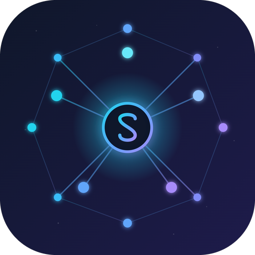

<p align="center">
  
</p>

<h1 align="center">AgentSkills</h1>

<p align="center">
  跨平台桌面应用，用于管理 AI 代理技能。<br>
  通过统一界面浏览、安装、同步和编辑 13 个代理的技能。
</p>

<p align="center">
  <a href="https://github.com/chrlsio/agent-skills/releases"></a>
  <a href="https://github.com/chrlsio/agent-skills/blob/main/LICENSE"></a>
  <a href="https://github.com/chrlsio/agent-skills/stargazers"></a>
</p>

<p align="center">
    <strong>简体中文</strong> | 
    <a href="./README.md">English</a>
</p>

---

## 支持的 AI 工具

- Claude Code
- Cursor
- Codex
- Gemini CLI
- GitHub Copilot CLI
- Kiro
- OpenCode
- Antigravity
- CodeBuddy
- OpenClaw
- Trae
- Windsurf
- Cline

## 功能

- **仪表盘** — 查看已安装的代理及每个代理的技能数量
- **技能管理** — 查看、编辑、卸载技能，跨代理同步
- **市场** — 从 [skills.sh](https://skills.sh) 和 [ClawHub](https://clawhub.ai) 浏览并安装技能
- **技能编辑器** — 在应用内直接编辑 SKILL.md 文件
- **文件监听** — 磁盘上技能变化时自动刷新
- **跨代理同步** — 一键将技能从一个代理同步到所有其他代理

## 技术栈

**前端：** React 19、TypeScript、Tailwind CSS 4、shadcn/ui

**原生核心层：** Rust、Tauri 2、SQLite

## 安装

### 方案 A：一行命令安装（推荐）

自动识别操作系统与架构，并从 GitHub Releases 选择匹配的安装包。

Linux / macOS：

```bash
curl -fsSL https://raw.githubusercontent.com/chrlsio/agent-skills/v0.1.2/install.sh | bash
```

Windows（PowerShell）：

```powershell
irm https://raw.githubusercontent.com/chrlsio/agent-skills/v0.1.2/install.ps1 | iex
```

支持格式：Linux（`.deb` / `.rpm` / `.AppImage`）| macOS（`.dmg`）| Windows（`.exe` / `.msi`）

如果遇到 GitHub API 速率限制，可先设置 `GITHUB_TOKEN` 再运行安装脚本。

### 方案 B：macOS 使用 Homebrew

```bash
# 1. 订阅当前仓库 Tap
brew tap chrlsio/agent-skills https://github.com/chrlsio/agent-skills

# 2. 安装 AgentSkills
brew install --cask agentskills
```

提示：如果遇到 quarantine 相关权限问题，可尝试 `--no-quarantine`。

### 方案 C：手动下载

- **macOS：** `AgentSkills.app` + `.dmg`
- **Windows：** `.msi` + `.exe`
- **Linux：** `.AppImage` + `.deb`
- 发布页：[GitHub Releases](https://github.com/chrlsio/agent-skills/releases)

### 常见问题排查（Troubleshooting）

#### macOS 提示“应用已损坏，无法打开”？

由于 macOS 的安全机制，非 App Store 下载的应用可能会触发此提示。

命令行修复（推荐）：

```bash
sudo xattr -rd com.apple.quarantine "/Applications/AgentSkills.app"
```

Homebrew 安装技巧：

```bash
brew install --cask --no-quarantine agentskills
```

## 快速开始

### 环境要求

- [Node.js](https://nodejs.org/) (v18+)
- [Rust](https://rustup.rs/) (stable)
- Tauri 平台依赖 — 参见 [Tauri 环境配置](https://v2.tauri.app/start/prerequisites/)

### 开发

```bash
# 安装依赖
npm install

# 启动开发环境（Vite + Tauri）
npm run tauri dev

# 仅前端（端口 1420）
npm run dev

# 类型检查
npx tsc

# Rust 测试
cd src-tauri && cargo test
```

### 构建

```bash
npm run tauri build
```

## 贡献

欢迎贡献！请先开 Issue 讨论你想要做的改动。

## 许可证

[MIT](./LICENSE)
